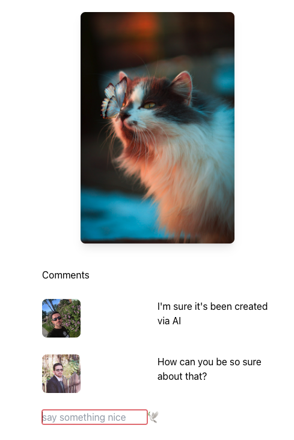

# Photo Finder

<b>Photo Finder</b> is a React JS app I wrote in order to try my hand at various React technologies. The resulting app
connects to [Unsplash](https://unsplash.com/developers) API for fetching photos; and also
uses [Cloud firestore](https://firebase.google.com/docs/firestore) for
sign-in and commenting on the pictures.

### Screenshot:

### Technologies used:

Current technologies used in this project are as follows:
<ul>
<li><a href="https://react.dev/">React JS</a></li>
<li><a href="https://tailwindcss.com/">Tailwind CSS</a></li>
<li><a href="https://firebase.google.com/docs/firestore">Cloud firestore</a></li>
<li><a href="https://github.com/csfrequency/react-firebase-hooks">React Firebase hooks</a></li>
<li>JavaScript</li>
<li><a href="https://webpack.js.org/">Webpack</a> bundler</li>
<li>HTML 5</li>
<li>CSS</li>
<li>Bootstrap</li>
<li>Git</li>
</ul>

### Development management:

Development board of the app is a trello board shared [here](https://trello.com/b/iD1sUwjN/photo-finder).
